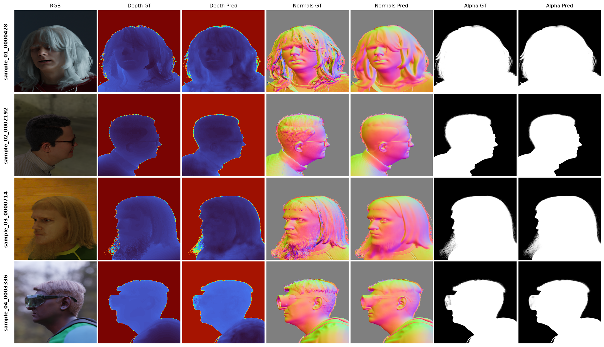

# DAViD: Data-efficient and Accurate Vision Models from Synthetic Data (Unofficial Implementation)

This is an **unofficial PyTorch implementation** of the ICCV 2025 paper [DAViD: Data-efficient and Accurate Vision Models from Synthetic Data](https://microsoft.github.io/DAViD). This repository contains training code and inference scripts for multi-task human perception including depth estimation, surface normal estimation, and foreground segmentation.

**Official Project Page:** https://microsoft.github.io/DAViD

## Model Architecture

The implementation uses a multi-head DPT (Dense Prediction Transformer) architecture:

- **Backbone:** ViT-Base-16 (384×384 input)  
- **Encoder:** Vision Transformer with DPT feature fusion
- **Decoder:** Multi-task heads for depth, normals, and alpha prediction
- **Features:** 256-dimensional feature maps
- **Paper Architecture:** Uses the resizer + decoder block design from the paper

## Implementation Notes

**Important:** The original DAViD repository does not provide training code or PyTorch model source code. This implementation was created based on the methodology and architecture described in the DAViD paper. This PyTorch implementation is **not compatible** with the ONNX model files provided in the official DAViD repository. The official ONNX models and this PyTorch implementation use different architectures and cannot be used interchangeably.


## Quick Start

### Installation

```bash
pip install -r requirement.txt
```

### Download Pre-trained Model

Download the pre-trained model weights from Google Drive and place them in the `models/` directory:

**Model Download:** [checkpoint_epoch_155.pth](https://drive.google.com/file/d/16uSXh18idxN4bbbr8ZXUYqk9MptWIUDQ/view?usp=sharing)

```bash
# Create models directory
mkdir -p models/

# Place the downloaded checkpoint_epoch_155.pth file in models/
# models/checkpoint_epoch_155.pth
```

### Run Demo

Simply run the demo script to test the model on the sample images:

```bash
python demo.py
```

The demo will:
- Load 4 sample images from `img/` directory  
- Run multi-task inference (depth, normals, foreground segmentation)
- Save visualization results to `output/demo_results.png`




**Note about the pre-trained model:** This model was trained using face/head images only (0000.zip ~ 0018.zip from the SynthHuman dataset, approximately 100k data samples). Body images were not included in training. The model was trained on one HPC with 4 RTX 4090 GPUs for a total of 26 hours.


## Training

### Dataset Preparation

1. **Download the SynthHuman dataset** from the [official DAViD project page](https://microsoft.github.io/DAViD)

2. **Extract and organize the dataset:**
   ```bash
   # Example directory structure
   /path/to/dataset/SynthHuman_0000/
   ├── rgb_0000000.png
   ├── alpha_0000000.png  
   ├── depth_0000000.exr
   ├── normal_0000000.exr
   ├── cam_0000000.txt
   └── ...
   ```

3. **Update dataset paths** in the training scripts:
   - Edit `data_roots` in `train.py` or `linux_train.py`
   - Point to your downloaded SynthHuman directories

### Single GPU Training

For single GPU training, use `train.py`:

```bash
python train.py
```

**Key configurations in train.py:**
- **Data paths:** Update `data_roots` list with your dataset directories
- **Batch size:** 16 (adjust based on GPU memory)
- **Learning rate:** 2e-4 with separate rates for backbone (0.1x) and heads (1x)
- **FP16 training:** Enabled by default for memory efficiency
- **Epochs:** 50 (adjust as needed)

**Training features:**
- Multi-task loss combining depth, surface normals, and alpha prediction
- Scale-shift depth alignment for robust depth estimation
- Progressive learning rate scheduling
- Automatic checkpoint saving and best model tracking
- Sample visualization during training

### Multi-GPU Training (Linux)

For distributed training on multiple GPUs, use `linux_train.py`:

```bash
python linux_train.py
```

**Multi-GPU configurations:**
- **Batch size per GPU:** 24 (total effective batch size: 96 for 4 GPUs)
- **Data parallel:** Uses DistributedDataParallel (DDP)
- **Automatic synchronization:** Loss averaging across GPUs
- **Robust error handling:** Continues training even if some operations fail
- **Checkpoint management:** Saves to shared storage location

### Training Tips

1. **Memory Management:**
   - Enable FP16 training to reduce memory usage
   - Adjust batch size based on your GPU memory
   - Use gradient accumulation for larger effective batch sizes

2. **Dataset Loading:**
   - The dataset loader automatically handles EXR files (depth/normals)
   - Supports multiple dataset directories for larger datasets
   - Includes data augmentation (horizontal flip, color jitter)

3. **Loss Function:**
   - **Depth Loss:** Scale-shift invariant + direct supervision
   - **Normal Loss:** Cosine similarity with masking
   - **Alpha Loss:** BCE + L1 + Dice loss combination

4. **Monitoring:**
   - Training samples are saved periodically to `training_samples/`
   - Checkpoints saved every 5 epochs
   - Best model tracked based on validation loss

### Resume Training

To resume from a checkpoint:

```bash
python train.py --load_pretrained path/to/checkpoint.pth
```


## Citation

If you use this implementation in your research, please cite the original paper:

```bibtex
@misc{saleh2025david,
    title={{DAViD}: Data-efficient and Accurate Vision Models from Synthetic Data},
    author={Fatemeh Saleh and Sadegh Aliakbarian and Charlie Hewitt and Lohit Petikam and Xiao-Xian and Antonio Criminisi and Thomas J. Cashman and Tadas Baltrušaitis},
    year={2025},
    eprint={2507.15365},
    archivePrefix={arXiv},
    primaryClass={cs.CV},
    url={https://arxiv.org/abs/2507.15365},
}
```
